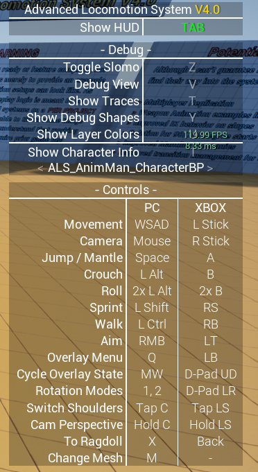
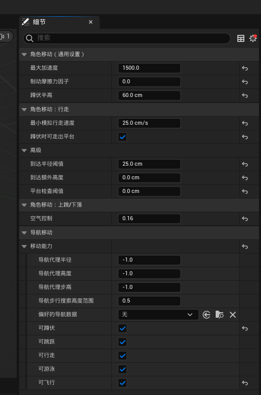
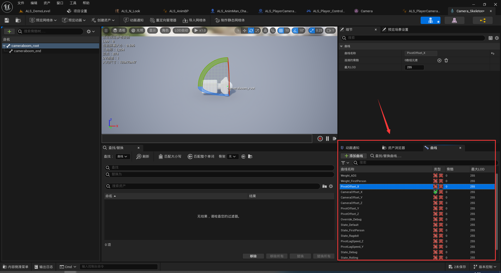
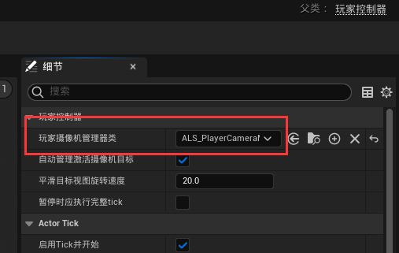
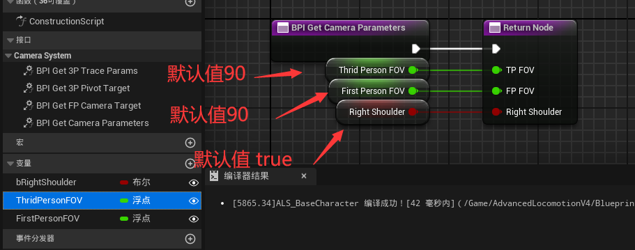
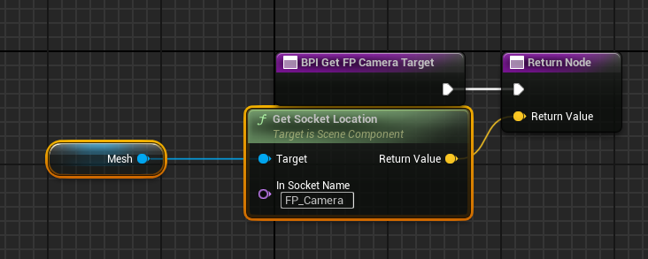
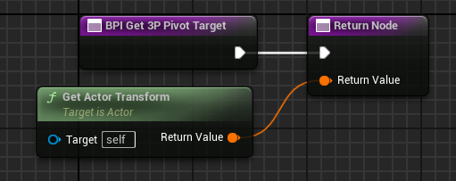
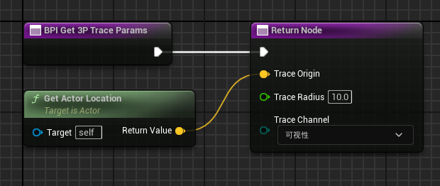
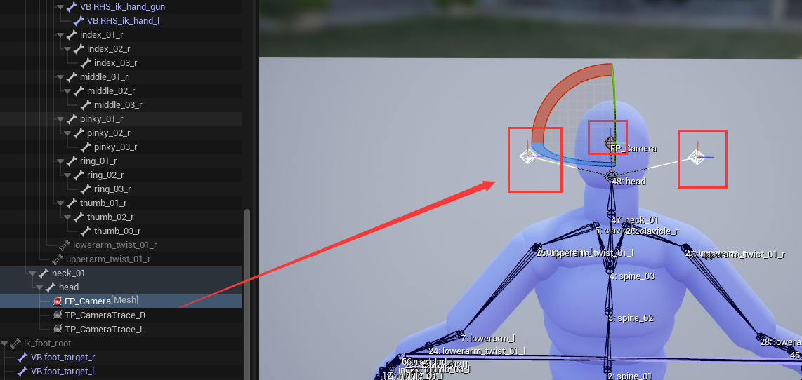

# ALSTutorial


如上图所示，为 ALS 项目的表现效果



上图展示 ALS 项目的控制按钮和介绍

| 按键 | 作用 |
| 1 | 切换为速度方向模式 |
| 2 | 切换为相机控制方向模式（默认） |
| Z | 慢动作 |
| V | 固定相机方向，方便查看角色状态 |
| T | 显示射线检测 |
| Y | 显示碰撞和方向（角色朝向、速度方向、加速度方向） |
| U | 显示身体各个部分的混合动画程度 |
| I | 展示细节属性面板 |

下面的就是角色移动控制

新建 `GameMode`、`CharacterBase`、`PlayerController`

设置 `CharacterBase` 的碰撞预设为 `ALS_Character`(ALS自带的，直接从ALS项目复制)，胶囊体高度设置为 90、半径设置为 30



> `MovementComponent` 如上修改
> **空气控制**：指的是在空中对角色移动的控制（即空中控制前进后退），地面值为1

继承 `CharacterBase` 创建 `ALS_Character` 的子类用作玩家，设置 Tag 为 `ALS_Character`；关闭 **控制器旋转Yaw**

## 摄像机

3C：`Camera`、`Character`、`Controller`，即相机、角色和控制器

之前在角色的 `Class Default` 中关闭了 **控制器旋转Yaw** 是为了后面能够单独控制相机旋转

继承 `PlayerCameraManager` 创建 `ALS_PlayerCameraManager`，并添加 `ALS` 项目中自带的 `Camera` 骨骼网格体

使用 `Camera` 骨骼网格体是为了方便的使用骨骼中定义的曲线



> 上图为 ALS 项目中 Camere 骨骼定义的曲线

最后将 `ALS_PlayerCameraManager` 设置到 `ALS_PlayerController` 中



摄像机系统利用**骨骼空间**计算出某一个位置，将这个位置坐标转换到**世界坐空间**上

新建 `ALS_Camera_BPI` 用于定义相机接口，由 `BaseCharacter` 来实现这些接口

> 子类可以重写这些接口的实现

```cpp
// 函数名 参数 => 返回类型

// 获取相机的参数 TP_FOV 第三人称的 FOV，FP_FOV 第一人称的 FOV，bRightShoulder 是否在右肩
BPI_Get_CameraParameters() => float TP_FOV, float FP_FOV, float bRightShoulder

// 获取相机朝向目标 ReturnValue 目标坐标
BPI_Get_FP_CameraTarget() => FVector ReturnValue

// 获取第三人称锚点目标的 Transform
BPI_Get_3P_PivotTarget() => FTransform ReturnValue

// 获取第三人称的检测参数 
BPI_Get_3P_TraceParams() => FVector TraceOrigin, float TraceRadius, ETraceType TraceChannel
```
| 函数名 | 实现 |
| --- | --- |
| BPI_Get_CameraParameters |  |
| BPI_Get_FP_CameraTarget |  |
| BPI_Get_3P_PivotTarget |  |
| BPI_Get_3P_TraceParams |  | 



