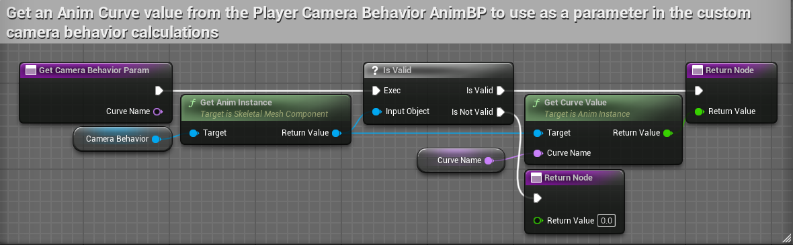

# ALSTutorial

## ALS 项目分析


如上图所示，为 ALS 项目的表现效果


上图展示 ALS 项目的控制按钮和介绍

| 按键 | 作用 |
| 1 | 切换为速度方向模式 |
| 2 | 切换为相机控制方向模式（默认） |
| Z | 慢动作 |
| V | 固定相机方向，方便查看角色状态 |
| T | 显示射线检测 |
| Y | 显示碰撞和方向（角色朝向、速度方向、加速度方向） |
| U | 显示身体各个部分的混合动画程度 |
| I | 展示细节属性面板 |

下面的就是角色移动控制

新建 `GameMode`、`CharacterBase`、`PlayerController`

设置 `CharacterBase` 的碰撞预设为 `ALS_Character`(ALS自带的，直接从ALS项目复制)，胶囊体高度设置为 90、半径设置为 30


> `MovementComponent` 如上修改
> **空气控制**：指的是在空中对角色移动的控制（即空中控制前进后退），地面值为1

继承 `CharacterBase` 创建 `ALS_Character` 的子类用作玩家，设置 Tag 为 `ALS_Character`；关闭 **控制器旋转Yaw**

### 摄像机

3C：`Camera`、`Character`、`Controller`，即相机、角色和控制器

`Camera` 摄像机需要关注两个点：相机坐标、相机朝向。通过设置这坐标和朝向可以决定我们最终得到的表现效果

`ALS` 项目中使用曲线和玩家骨骼坐标来定位相机坐标，实现相机平滑移动的效果

之前在角色的 `Class Default` 中关闭了 **控制器旋转Yaw** 是为了后面能够单独控制相机旋转

继承 `PlayerCameraManager` 创建 `ALS_PlayerCameraManager`，并添加 `ALS` 项目中自带的 `Camera` 骨骼网格体

使用 `Camera` 骨骼网格体是为了方便的使用骨骼中定义的曲线


> 上图为 ALS 项目中 Camere 骨骼定义的曲线

最后将 `ALS_PlayerCameraManager` 设置到 `ALS_PlayerController` 中


摄像机系统利用**骨骼空间**计算出某一个位置，将这个位置坐标转换到**世界坐空间**上

新建 `ALS_Camera_BPI` 用于定义相机接口，由 `BaseCharacter` 来实现这些接口

> 子类可以重写这些接口的实现

```cpp
// 函数名 参数 => 返回类型

// 获取相机的参数 TP_FOV 第三人称的 FOV，FP_FOV 第一人称的 FOV，bRightShoulder 是否在右肩
BPI_Get_CameraParameters() => float TP_FOV, float FP_FOV, float bRightShoulder

// 获取相机朝向目标 ReturnValue 目标坐标
BPI_Get_FP_CameraTarget() => FVector ReturnValue

// 获取第三人称锚点目标的 Transform
BPI_Get_3P_PivotTarget() => FTransform ReturnValue

// 获取第三人称的检测参数 
BPI_Get_3P_TraceParams() => FVector TraceOrigin, float TraceRadius, ETraceType TraceChannel
```
| 函数名 | 实现 |
| --- | --- |
| BPI_Get_CameraParameters |  |
| BPI_Get_FP_CameraTarget |  |
| BPI_Get_3P_PivotTarget |  |
| BPI_Get_3P_TraceParams |  | 

在 `ALS_Character` 中对上述函数进行重写

| 函数名 | 函数体 |
| --- | --- |
| BPI_Get_3P_PivotTarget |  |
| BPI_Get_FP_CameraTarget |  |
| BPI_Get_3P_TraceParams |  |


`ALS` 的添加了一些虚拟骨骼用于绑定和定位

上面这些接口都是方便计算 `Camera` 相机的坐标和朝向的

曲线有多种添加方式：可以新建 Curve 曲线、可以在动画资产中添加曲线、可以在骨骼中添加曲线

`ALS` 的相机在骨骼中添加曲线，在 `Curves` 框中直接右键就可以添加曲线


这里定义的曲线，在动画蓝图中可以直接获取并对值进行 `Blend`


> 在 `Modify Curve` 节点上右键可以添加曲线和设置曲线的值



> 在蓝图中可以通过 `Get Curve Value` 来获取曲线的值

**综上所述，在 `Camera` 的骨骼中定义曲线名称，在动画蓝图中计算曲线对应的值，在 `PlayerCameraManager` 中根据曲线的值和目标坐标进行相机的坐标和朝向计算**

#### Camera 的动画蓝图


每帧更新属性状态数值，在根据状态的不同， `Blend` 出各个 `Curve` 的数值


可以理解为，提前预设出很多套曲线数值模板，根据状态的不同，选择不同的曲线数值

#### PlayerCameraManager 中的计算

`PlayerCameraManager` 中的计算分文两部分：**初始化** 和 **Tick更新**

在 `OnPossess` 的进行初始化操作

在 `ALS_PlayerCameraManager` 中，当绑定到对象后会触发 `OnPossess` 事件并将绑定的 `Pawn` 作为参数传递

为了方便使用，直接将其值传递给 `Camera` 的动画蓝图


在 `BlueprintUpdateCamera` 中进行每帧更新的计算操作


如果控制的角色含义 `ALG_Character` 的 `Tag` 表示这是使用 ALS 动画蓝图的对象，走 `Custom Camera Behavior` 计算，否则走父类的计算流程(也就是默认流程)

所以计算的核心还是在 `Custom Camera Behavior`


- `RootPoint`: 相机追踪目标(ViewTarget)的Root点，一般就是目标的根节点
- `PivotPoint`：枢纽点，相机会围绕这个点进行旋转
- `LooAtPoint`：看向点，相机会始终注视着这个位置


- 绿色球为 `RootPoint`，其坐标是 `head` 和 `root` 的中心点
- 红色球为 `Smmothed Pivot Target`，是通过根据 `RootPoint` 插值计算出的平滑点
- 蓝色球为 `Pivot Point` 即珍重的枢纽点，相机围绕该点旋转
- 相机坐标为 `Target Camera Location`，根据 `Pivot Point` 坐标和相机旋转计算出的坐标

其实 ALS 的作者注释写的很全面，在 `Custom Camera Behavior` 函数中分为 8 步

1. 通过接口初始化本次计算的数据
2. 计算相机平滑旋转：通过计算当前相机旋转和控制器旋转的插值
3. 计算相机平滑移动的坐标和朝向
4. 计算注视点
5. 计算相机最终的坐标
6. 通过射线检测，防止摄像机穿模
7. 绘制 Debug 球体
8. 计算最终返回值

> 上面的计算使用到了曲线的数值


通过接口获取 

- `Pivot Target` 其坐标是 `head` 和 `root` 骨骼坐标的中点、旋转是角色当前旋转角度
- `FPTarget` 是骨骼 `FP_Camera` 点的坐标
- `TPFOV` 和 `FPFOV` 是设定值，默认为 90


通过相机的朝向和玩家 `Controller` 的朝向插值计算出 `TargetCameraRotation`

`RotationLogSpeed` 是相机骨骼中定义的曲线，在相机的动画蓝图中通过 `Modify Curve` 来控制值，其值为 20


通过当前的 `Pivot Taret` 的 `Transform` 和上一帧的 `Smoothed Pivot Target` 配合 `PivotLagSpeed_X`、`PivotLagSpeed_Y`、`PivotLagSpeed_Z` 插值计算出当前` Smoothed Pivot Target` 的 `Location`


这里需要注意的是 `Calculate Axis Independent Lag` 函数的实现，没太懂 `UnRotate Vector` 和 `Rotate Vector`，但是直接使用 `Current Location`、`Target Location`、`Log Speeds` 进行插值计算，也可以得到相似的效果


根据 `Smoothed Pivo Taret` 的 `Rotation` 获得当前朝向的前、右、上三个方向的向量，再根据 `PivotOffset_X`、`PivotOffset_Y`、`PivotOffset_Z` 分别计算各个轴的值，再叠加 `Smoothed Pivot Target` 的坐标，计算出真正的 `Pivot Location`

> X 轴是前后、Y 轴是左右、Z 轴是上下


根据 `Target Camera Rotation` 相机朝向计算出前、右、上三个方向的向量，再根据 `CameraOffset_X`、`CameraOffset_Y`、`CameraOffset_Z` 计算出偏移值，最后叠加到 `Pivot Location` 得到真正的相机坐标


如图上图所示完成了第6步，使用射线检测避免了相机穿模和相机在墙后的情况

### 角色动画蓝图

